# Hermit - An Ergonomic Narrow-Pitch Split Keyboard

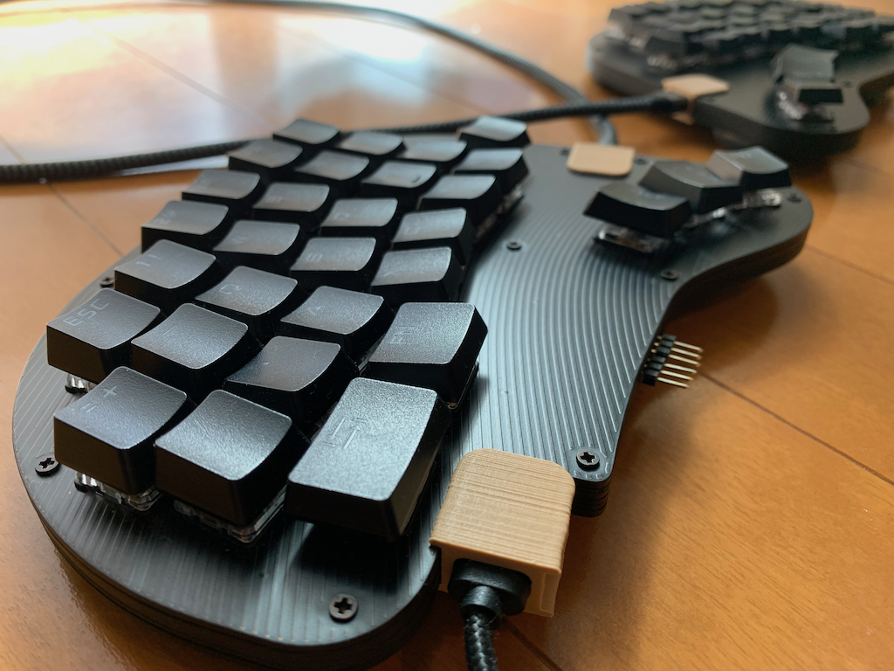</img>

## Introduction
This is a personal hobby project on DIY keyboard.
The name *Hermit* comes from its key-switch layout: it looked like a hermit crab.
Before working on this "full" keyboard, I made a test split keypad with 10 keys as a proof of concept model, which was named *Zoea*.

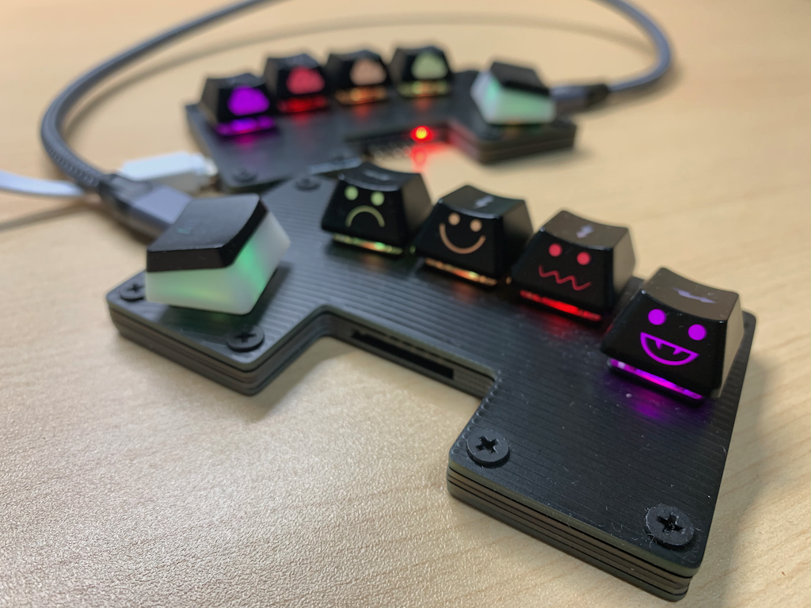</img>

### Features
- Symmetric split with 60 keys
  - Key switch: Choc V2
  - Narrow pitch: 17.4 x 16.8mm
  - Thumb keys placed a bit further (to press them with the first joint)
  - Full color RGB
- Controller
  - ARM (STM32F042K6T6)
  - I/O expander (MCP23017) via I2C (using USB Type-C cable)
  - Debounce CR circuit (firmware reads Col 1ms after setting Row)
- Firmware
  - C++ bare-metal (STM32CubeIDE)
  - Stream with FIFO's (no immediate sending of key presses/releases)
  - Emacs translation (ex. `C-d` -> `Del`)

## Key-switch Layout
Before assembling ErgoDash, I really liked the key touch of Realforce and used it for a decade.
However, once I got used to ErgoDash, I could not go back to Realforce anymore because `B` key was too far for my left index finger.
In fact, I started feeling pain in the index finger after typing on Realforce for a day.

One day, I came across [Treadstone](https://booth.pm/ja/items/1434972) layout, where the `B` key, or the left half of the bottom row, is shifted to the left a bit.
I thought this is the answer for me and I should follow this design.
Because I was also intrigued by Alice layout, I decided to start off with some sort of mixture of Alice and Treadstone...

### Cardboard test
To begin with, I placed keycaps on a cardboard with lines of double sided tapes on it, and try tapping on it.
Sometimes added more keys, and other times removed some of them.

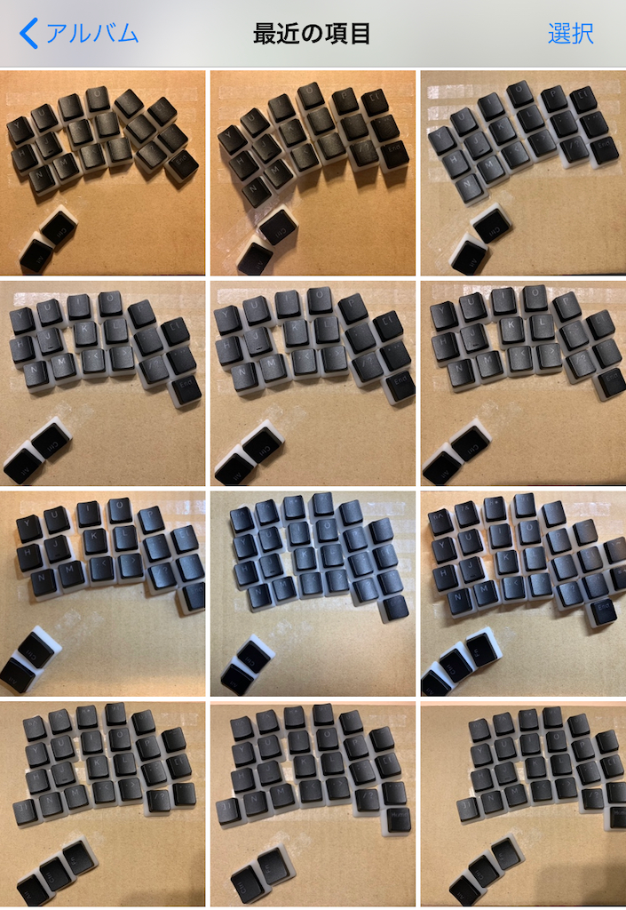</img>

### 3D printer test
After I purchased a 3D printer, I continued the layout test using the actual Choc V2 key switches adjusting:
- Number of keys
- Key pitch: 17.0 ~ 18.0mm
- Thumb keys position, angle

Because I usually use Japanese key layouts, I found that 60 keys is the minimum that I can accept.

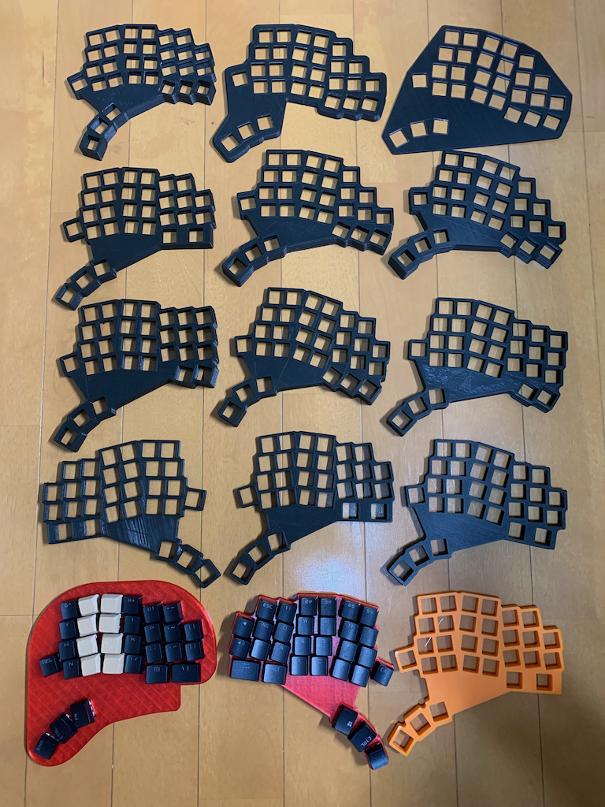</img>

### Parametric model
When the layout was roughly determined, I tried to parametrize the layout to adjust the degree of ergonomic-ness.
The strategies are:
- Ring finger keys are on a straight line
- `B` is a bit on the left of `G`
- Pinky finger keys are lower than ring finger keys
- Keys are tightly touching to each other

And finally, settled down on the current layout.

</img>

## PCB Design
This keyboard is composed of 6 PCB layers and is 8mm thick in total.
- Top layer (1.6mm)
- Second top layer (0.8mm)
- Circuit layer (1.6mm, Left and Right)
- Mid layer (1.6mm x2)
- Bottom layer (1.6mm)

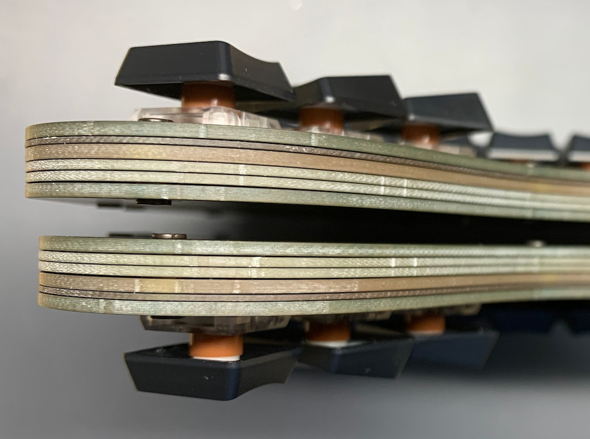</img>

### Top
- Supports key switches.
- Common for Left and Right.

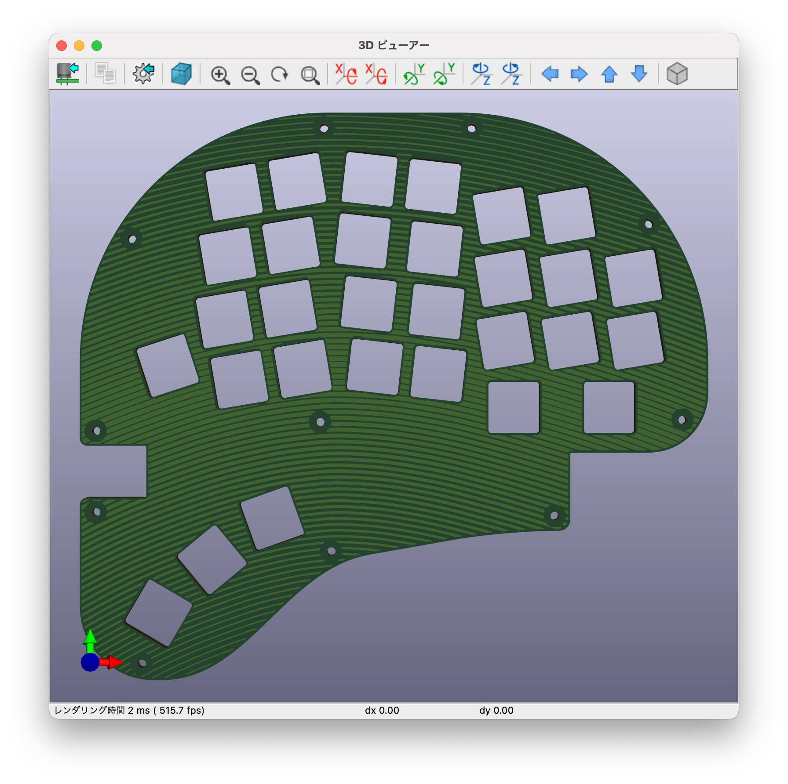</img>

### Second top
- Fills in the gap between the top plate and the bottom of the key-switch box.
- Gives holes for USB connecter terminals.
- Common for Left and Right.

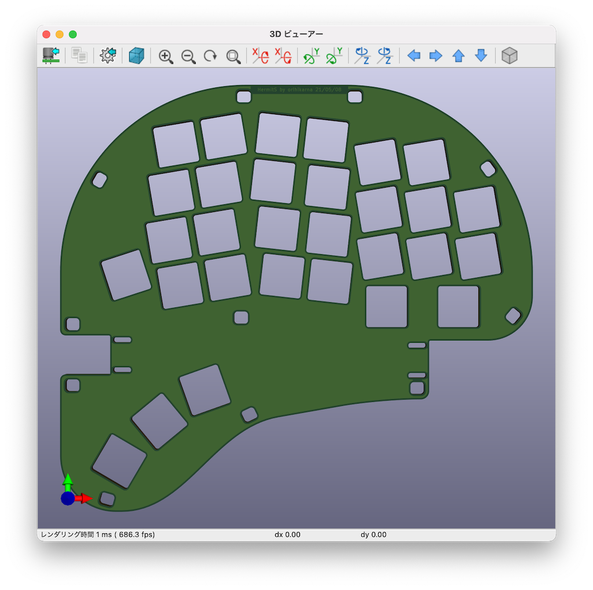</img>

#### Circuit Left & Right
- Implements the circuitry, and connecters.

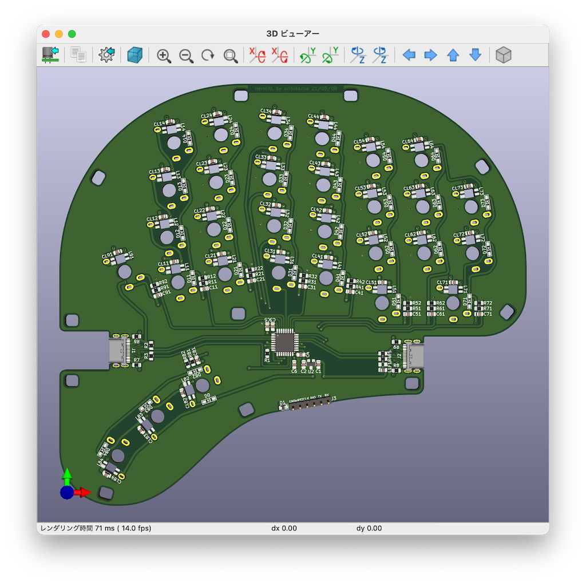</img>
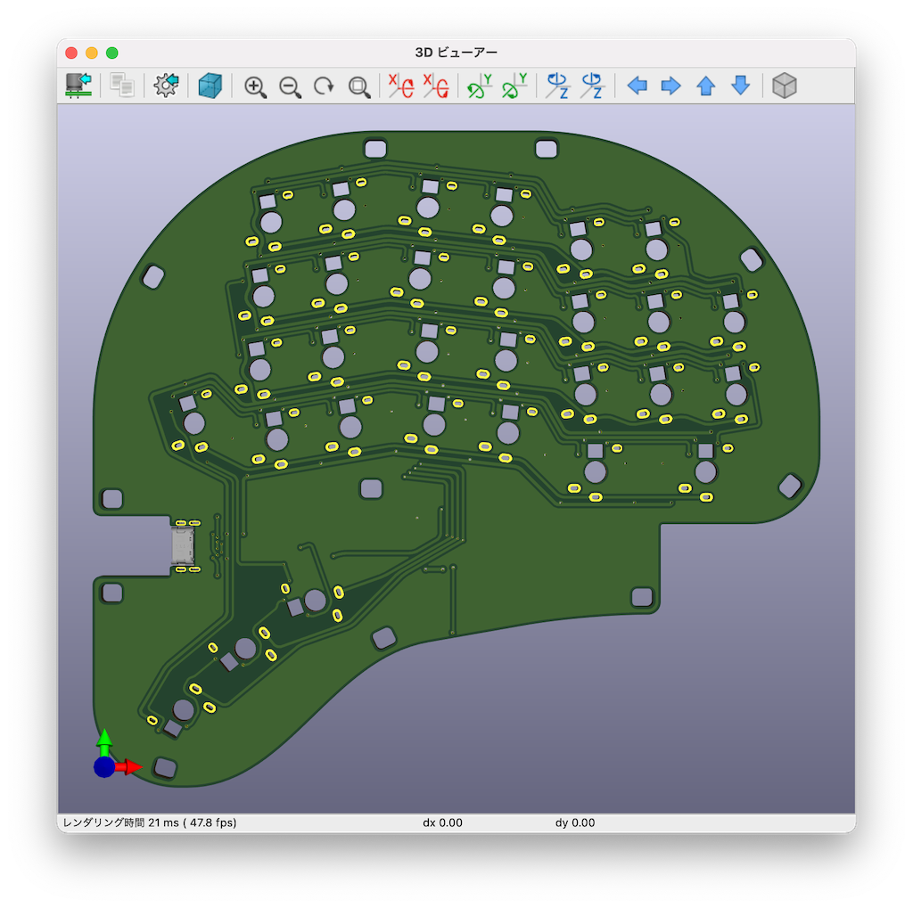</img>

#### Middle
- Fills in the gap between the bottom plate and the bottom of the key-switch axis.
- Remove USB connecter part for Left.

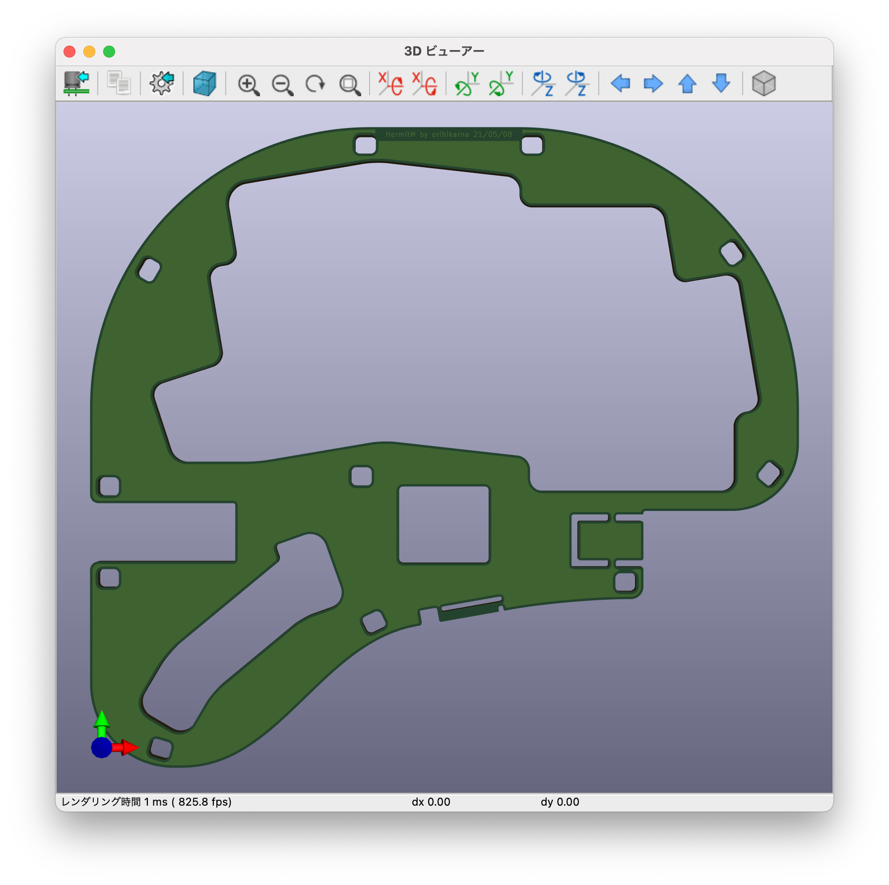</img>

#### Bottom
- Common for Left and Right.

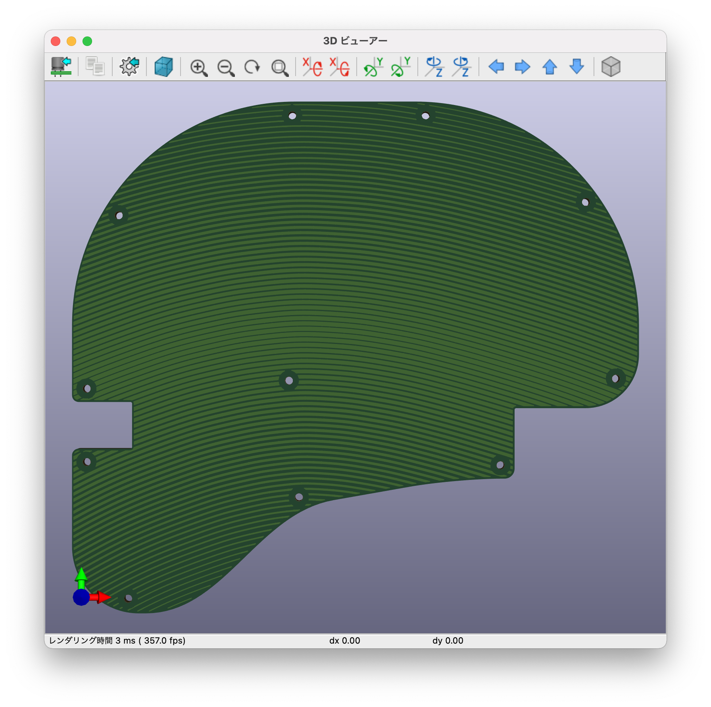</img>

### Place & route by Python script
All the footprint placement, wire routing, vias, silkscreen labels, Edge.Cuts and GND zones are done by Python scripts.
Currently, only the component side (Front or Back) needs to be set manually first.
Then, from `Script Console` of Pcbnew layout editor, run
```
exec(open('/(your path)/Hermit/python/place-route-Hermit.py').read())
```
and everything will be done!

For example, the wire from C21 pad 1 to U1 mcu pad 29 is written as below:
```
            ('C21', '1', 'U1', '29', w_mcu, (Dird, 90, ([(5.8, 90)], 0), r_col)),
```
This means that:
- the wire width is w_mcu
- from C21 pad 1, extend wire in the direction of 90deg
- from U1 pad 29, draw a wire for 5.8mm in the 90deg direction, and then, extend it to the direction of 0deg
- make corners round by radius r_col

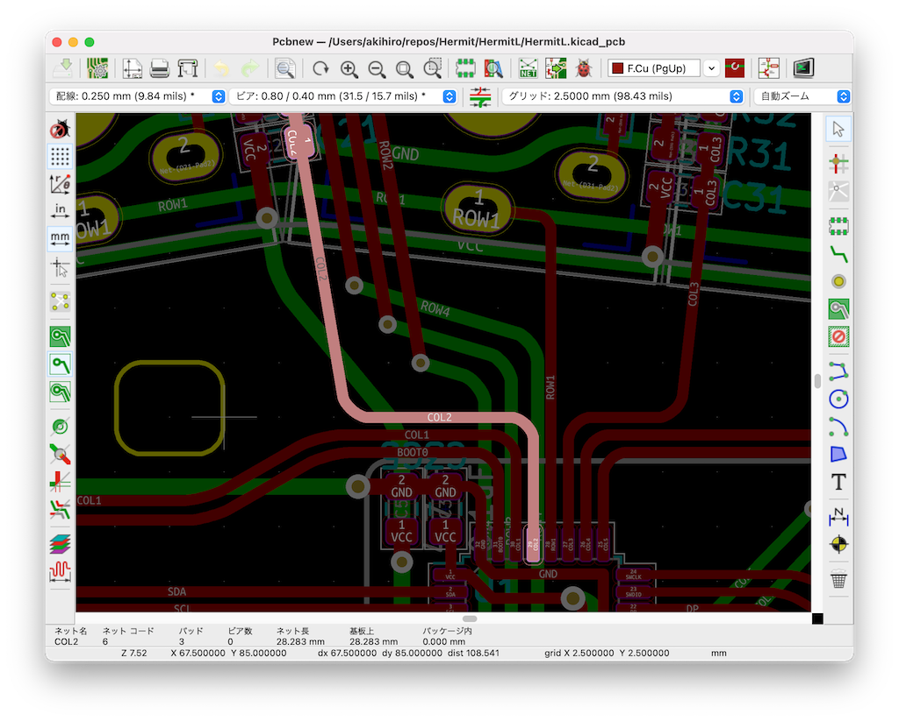</img>

### Rectangular hole for hexagonal screws
In Zoea PCB, it was useful to use hexagonal hole for spacers to keep them fixed.
However, the choice of the radius and the corner R is not easy.
Therefore this time, I used rectangular holes for the same purpose without being affected by the factory's milling capability.

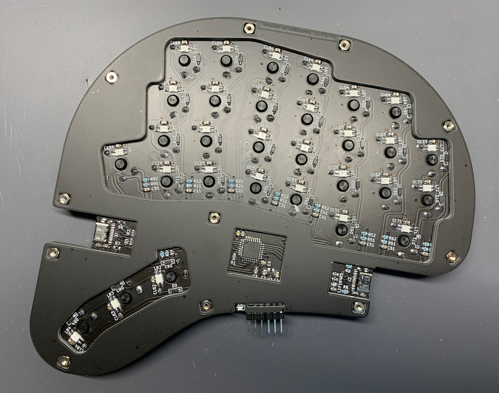</img>

### Boundary processing using distance transform


## Debounce RC circuit
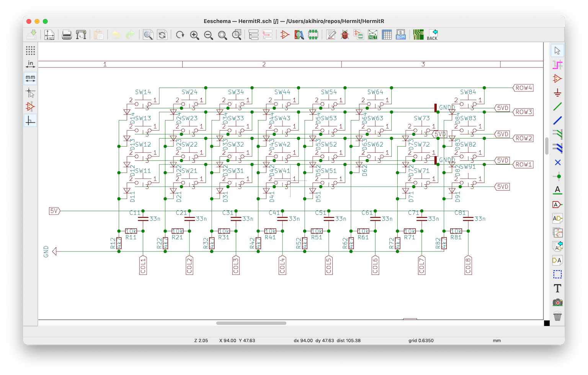</img>

## Firmware
For my studying, wrote the firmware from scratch instead of using qmk.

- text: 14KB
- data+bss: 2.5KB

### Full Color RGB LED
<blockquote class="twitter-tweet"><p lang="ja" dir="ltr">虹の形のRAINBOWにしてみた😆 <a href="https://t.co/fvA94oZMJb">pic.twitter.com/fvA94oZMJb</a></p>&mdash; orihikarna (@orihikarna) <a href="https://twitter.com/orihikarna/status/1439446049446264836?ref_src=twsrc%5Etfw">September 19, 2021</a></blockquote> <script async src="https://platform.twitter.com/widgets.js" charset="utf-8"></script>

## Acknowledgements
- [libusb_stm32](https://github.com/dmitrystu/libusb_stm32)
- [mini-printf](https://github.com/mludvig/mini-printf)
