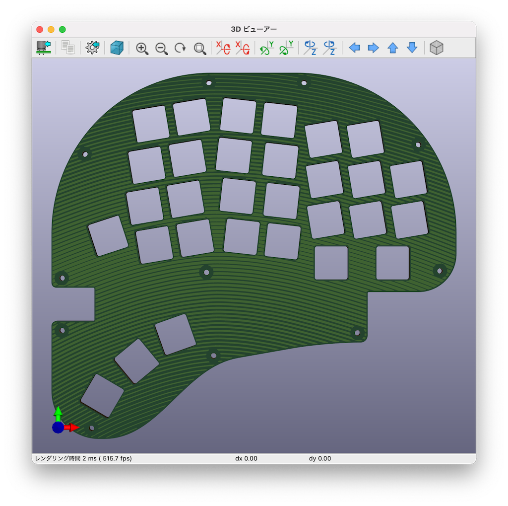
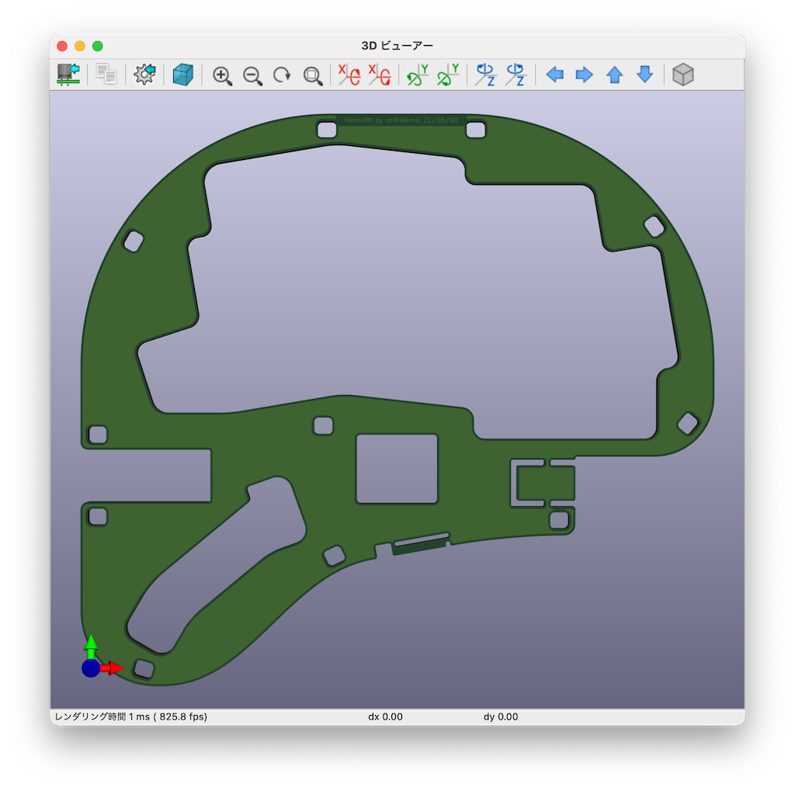
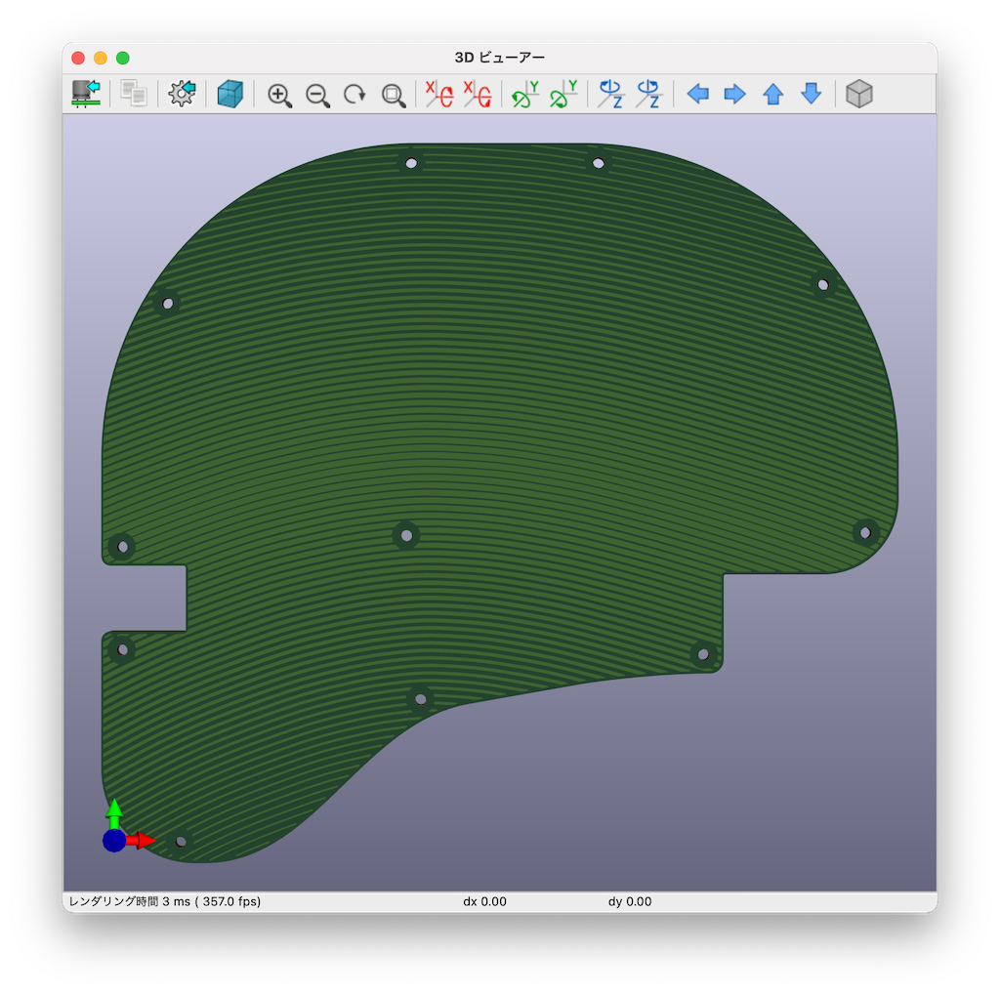

# Hermit - An Ergonomic Narrow-Pitch Split Keyboard

</img>

## Introduction
This is a personal hobby project on DIY keyboard.
The name *Hermit* comes from its key switch layout: it looked like a hermit crab.

Before working on this "full" keyboard, I made a test split keypad with 10 keys as a proof of concept model, which was named *Zoea*.

</img>

### Features
- Symmetric split with 60 keys
  - Key switch: Choc V2
  - Narrow pitch: 17.4 x 16.8mm
  - Thumb keys placed a bit further (to press them with the first joint)
  - Full color RGB LED
- Controller
  - ARM (STM32F042K6T6)
  - I/O expander (MCP23017) via I2C (using USB Type-C cable)
  - Debounce RC circuit (firmware reads Col 1ms after writing Row)
- Firmware
  - C++ bare-metal (STM32CubeIDE)
  - Stream processing with FIFO's (no immediate sending of key presses/releases)
  - Emacs translation (ex. `C-d` -> `Del`)

## Key switch layout
Before assembling ErgoDash, I really liked the key touch of Realforce and had used it for a decade.
However, once I got used to ErgoDash, I could not go back to Realforce anymore because `B` key was too far for my left index finger.
In fact, I started feeling pain in the index finger after typing on Realforce for a day.

One day, I came across [Treadstone](https://booth.pm/ja/items/1434972) layout, where the `B` key, or the left half of the bottom row, is shifted to the left a bit.
I thought this is the answer for me and I should follow this design.

### Cardboard prototyping
To begin with, I placed keycaps on a cardboard with lines of double sided tapes on it, and try tapping on it.
Sometimes added more keys, and other times removed some of them to find one that suits my fingers.

</img>

### 3D printer prototyping
After I purchased a 3D printer, I continued the seek for the layout using the actual Choc V2 key switches on 3D printed frames.
It enabled me to more finely adjust:
- Number of keys
- Key pitch: 17.0 ~ 18.0mm
- Key column positions and angles, especially for the thumbs

I usually use Japanese key layouts, and I found that 60 keys is the minimum that I can accept.
I wanted to keep most of the symbol keys on the board (without layers).

</img>

### Parametric model
When the layout was roughly determined, I tried to parametrize the layout to adjust the degree of ergonomic-ness.
The strategies are:
- Ring finger keys are on a straight line
- `B` is a bit on the left of `G`
- Pinky finger keys are lower than ring finger keys
- Keys are tightly touching to each other

And finally settled down on the current layout.

</img>

## PCB Design
This keyboard is composed of 6 PCB layers and is 8mm thick in total.
- Top layer (1.6mm)
- Second top layer (0.8mm)
- Circuit layer (1.6mm, Left and Right)
- Mid layer (1.2mm x2)
- Bottom layer (1.6mm)

</img>

I used KiCad v5.1.5 for the PCB design.

### Top
- Supports key switches.
- Common to Left and Right (reversible).

</img>

### Second top
- Fills in the gap between the top plate and the bottom of the box part of the key switches.
- Gives holes for USB connecter terminals.
- Common to Left and Right.

</img>

#### Circuit Left & Right
- Implements the circuitry, and USB connecters.

</img>
</img>

#### Middle
- Fills in the gap between the bottom plate and the bottom of the axis part of the key switches.
- USB connecter island will be removed for Left.

</img>

#### Bottom
- Common to Left and Right.

</img>

### Place & route by Python script
All the footprint placement, wire routing, vias, silkscreen labels, Edge.Cuts and GND zones are done by a Python script.

Currently, only the component side (Front or Back) needs to be set manually first.
Then, from `Script Console` of Pcbnew layout editor, run
```
exec(open('/(your path)/Hermit/python/place-route-Hermit.py').read())
```
and everything will be done in seconds!
(Although it took 2 month for me to write the script, of course!)

For example, in the script, the wire from C21 (debounce capacitor) pad 1 to U1 (main mcu) pad 29 is written as:
```
            ('C21', '1', 'U1', '29', w_mcu, (Dird, 90, ([(5.8, 90)], 0), r_col)),
```
This means that:
- the wire width is w_mcu
- from C21 pad 1, extend wire in the direction of 90deg
- from U1 pad 29, draw a wire for 5.8mm in the 90deg direction, and then, extend it to the direction of 0deg
- the intersection of the two lines will automatically be found
- make corners round by radius r_col

</img>

This way, the wiring is parallel to each part and looks roundy at corners.

## Debounce RC circuit
The mechanical key switches chatter sometimes.
Most DIY keyboards use software debouncing technique that comes with qmk (the standard keyboard firmware), where the key state (pressed or not) is examined twice with several milliseconds interval.
So, the switch bounce is hidden usually.
However, for the last two years, I experienced a couple of keys of my ErgoDash exhibited the chattering only in a specific season, i.e., in July or August in Japan.
I guess the software debounce might not be enough when it is very hot and super humid.
I've therefore added debounce RC for each column lines:

</img>

- When a key switch is released,
  - the Col lines are pulled down to GND.
  - the capacitors are fully charged.
- When a key switch is pressed,
  - the Row lines discharge the capacitors through key matrix diodes.
  - the Col lines rise to 5.0V or 3.3V minus 0.7V of the diode drop
- The time constant is different for discharging and charging, but they are set to about 1ms.
- Firmware needs to wait for 1~2ms before reading Col lines after writing Row lines.

I will check if this will actually contribute to reduce the switch bounce in the next summer!

For more information on hardware debounce, please refer to articles such as
[Ultimate Guide to Switch Debounce (Part 3)](https://www.eejournal.com/article/ultimate-guide-to-switch-debounce-part-3/)


## Rectangular holes for hexagon spacers
In Zoea PCB, it was useful to use hexagonal hole for spacers to keep them fixed: they won't rotate when tightening screws from the top and the bottom plates.
However, I needed to carefully choose the hexagon radius and the radius of the hexagon corners taking into account the endmill diameter.
So, this time, I used rectangular holes for the same purpose. I didn't have to consider much about the radius of the rectangle corners because any value would be fine with hexagon.

</img>

## Boundary avoidance using distance transform
I wanted to fill the surface of the top and the bottom plates with some design other than just nothing.
I'm not an artsy person at all, so I decided to draw simple stripes on them that curve along with the key switch angles.
The problem was that, how to end the stripe lines at the boundary of the board, screw holes, and of course the key switch holes. I didn't want that to happen all of a sudden abruptly.

So, I figured out a way to end lines just before the boundaries:
1. Export Edge.Cuts to svg (KiCad)
1. Rasterize svg to png (cairosvg Python package)
1. Binarize png to a mask image
1. Find connected components in the mask (OpenCV)
1. Choose the PCB component
1. Set initial distance (inside PCB = infinity, outside = 0)
1. Execute distance transform (OpenCV)

Then, you will get the distance from the boundaries.
It would be easier to end lines nicely at the boundaries: if it is near the boundary, you can use the distance value to find where to end the line.

The following figures are from Zoea top layer. First, the distance transform.

</img>

The final stripes on PCB. The thickness is reversed on its front and back.

</img>

It looked ok that time, however, I wanted to get closer to the edge this time...
So, divided thick lines into a multiple of thin lines:

</img>

and then, drew vertical / slant lines that connect the ends of thin horizontal lines:

</img>

## Firmware
For my studying of embedded programming, I wrote the firmware from scratch instead of using qmk.

### Stream processing
One thing I was thinking about qmk was register_code() and unregister_code() functions: these are used everywhere to send keycodes in the chain of processing.
However, since they send keycodes immediately, there is no room to to do more processing on the processed keycodes in the middle of the chain.

Of course, there are pros and cons.
But I wanted to try a stream structure, where each keycode processor is connected with FIFOs one after another to allow for successive processing.
Also, only one HID report will be prepared in the big loop that runs every 2ms.

A difficult part is the estimation of the required size for each FIFO.
If the FIFO size is too short, a processor in the chain cannot output anything and the entire stream would get stuck.

### Full Color RGB LED
At first, I placed LC8822-2020 on the key switch side of PCB.
They are good since they have separate data and clock lines (total 6 lines).
However, I noticed later that when they got broken, it is difficult to replace them because key switches are soldered above them.

Then, I decided to use SK6812-MINI-E, which is commonly used in DIY keyboards.
It has only one line for both data and clock, so it needs strict timing to send data.
There are 60 keys on Hermit, so that it takes 2ms to send series of data for all of them at once.
As 2ms felt too long, I split them to left and right half, and reduced the duration of interrupt-disabled periods to 1ms each.

</img>

### Emacs translation
I have been using Emacs key-binding for years.
There are ways to emulate it in a software manner on Windows, but what if it is inside a keyboard itself?

Although the current implementation needs tap & hold for single press of CTRL and ALT, other than that, it is working nicely!

### Minimizing the code size
At first, the code bloated with STM32 HAL USB library and printf (for debugging purpose) to more than 20KB.
However, thanks to STM32 LL library and the following libraries:
- [libusb_stm32](https://github.com/dmitrystu/libusb_stm32)
- [mini-printf](https://github.com/mludvig/mini-printf)

even after implemented RGB effects and Emacs translations, the current code size is:
- text: 16KB
- data+bss: 2.5KB

namely, only the half of STM32F042 capacity (32KB/6KB) is used.

## USB connector holders
For USB Type-C connectors, I gave up using the full 24-pin type due to the lack of my ability to solder them on PCB.
Instead, 16-pin type is used, where I2C is sent over D+/D- and LED signal is sent over SBU1/2.
Although other USB3.0 signal lines are not used at all, only because SBU1/2 is used, "full spec" Type-C cable is required to connect left and right.
They are thick in general and their stiffness gives strong forces on USB connectors.
So, I printed a simple-extrusion-work cable connector holder for them.
They need to be printed for each connector shape, but fit well and the cables are firmly attached to the keyboard.

</img>

## Finally, a short video
[Rainbow shaped Rainbow effect](https://twitter.com/orihikarna/status/1439446049446264836)

<a href="https://twitter.com/orihikarna/status/1439446049446264836"></a>
